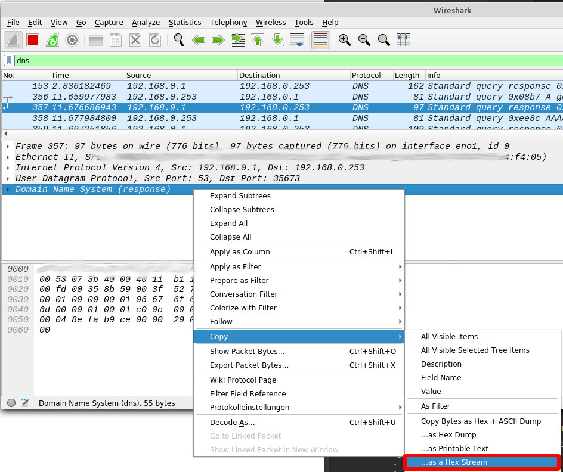
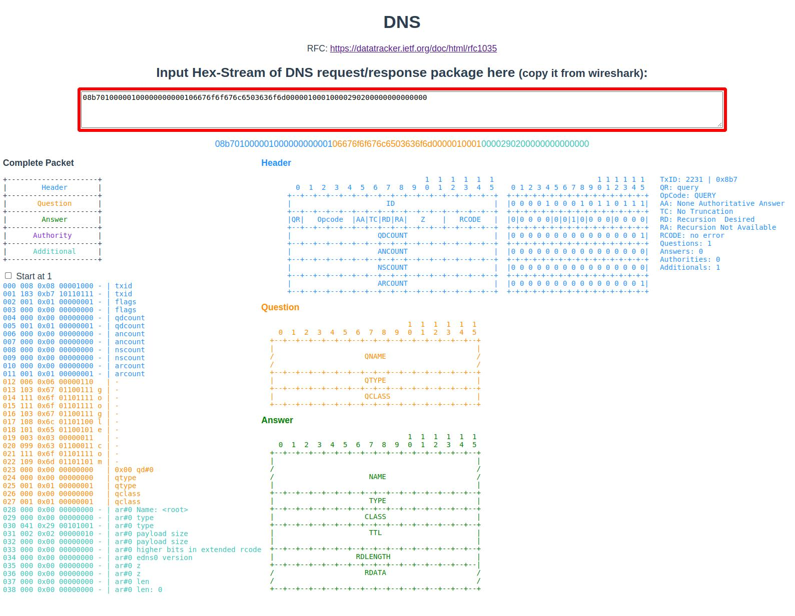

# Byteanalyzer

This project is for some basic encoding of hex streams and to visualize them.

## Supported package types
 * DNS

## Get data
1. Start wireshark, filter for 'dns' and copy the dns content as hex stream.


2. Paste the string into the textfield on the page


## Project setup
```
npm install
npm run serve # for dev
npm run build # prod build
```
